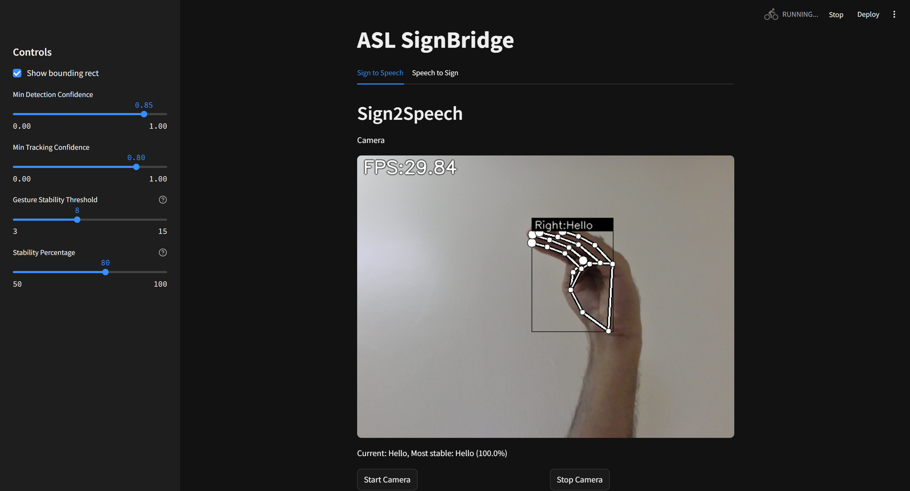
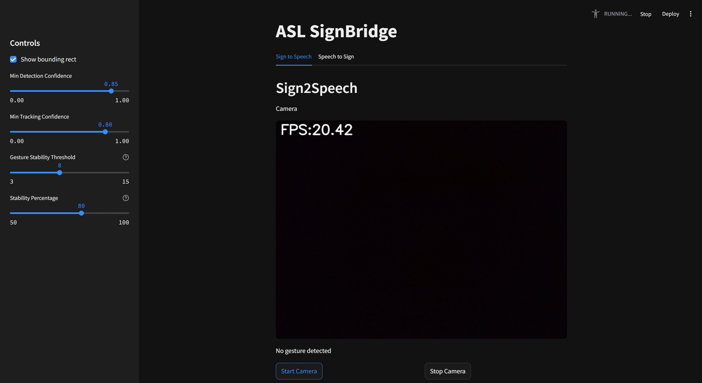
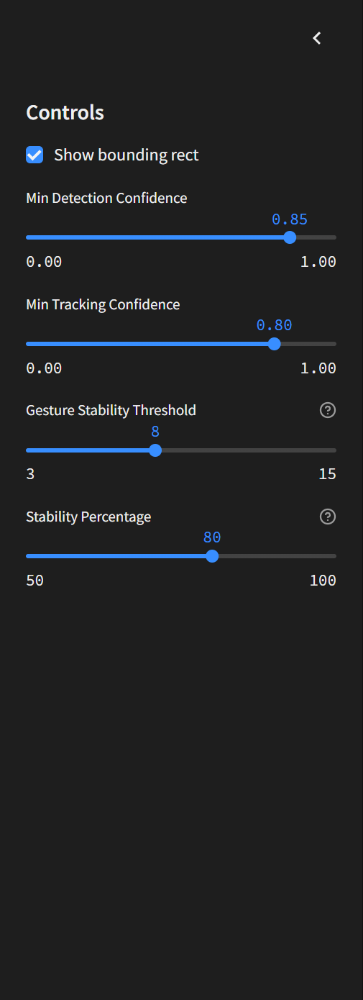

# 🖖 ASL SignBridge: Hand Gesture Recognition for Accessibility

Real-time American Sign Language (ASL) translator powered by computer vision and machine learning, enabling both Speech-to-Sign and Sign-to-Speech communication.

🚀 This project was built during the ADU Hackathon 2025 in May, 2025.

## 📝 Overview

ASL SignBridge is an interactive application that bridges communication gaps between sign language users and non-signers. Using computer vision and machine learning, this application:

1. **Recognizes Hand Gestures** in real-time using a webcam
2. **Converts Signs to Speech** through a text-to-speech engine
3. **Provides Visual Feedback** showing detected gestures and confidence levels

This tool is designed to make communication more accessible for deaf and hard-of-hearing individuals by providing immediate audio translation of common sign language gestures.

## 🔍 Tech Insight

- **Real-time Hand Tracking** using MediaPipe's hand landmark detection
- **Machine learning-based Gesture Classification** with TensorFlow
- **Text-to-Speech Conversion** for immediate audio feedback
- **Gesture Stability Detection** to prevent false positives
- **Intuitive UI** with Streamlit for easy interaction
- **Adjustable Sensitivity Controls** for different environments and users

## 📷 Screenshots

### Main Interface


### Gesture Recognition in Action


### Settings Panel


## 🤓 How It Works

### ⚙️ Technical Architecture

1. **Hand Detection**: Uses MediaPipe's hand tracking to identify and track 21 key points on the hand
2. **Preprocessing**: Normalizes hand landmark coordinates to be position and scale-invariant
3. **Classification**: Passes normalized coordinates to a trained neural network model
4. **Stability Checking**: Ensures consistent gesture detection before triggering speech output
5. **Speech Synthesis**: Converts recognized gestures to spoken words using pyttsx3

### 🖐🏻 Trained Gestures

The current model recognizes the following gestures/phrases:
- Hello
- How Are
- You Are
- I am
- Am
- Good
- Thirsty
- Thank you
- Beautiful
- Goodbye
- You

## 📂 Installation

### Prerequisites
- Python 3.7+
- Webcam

### Setup

1. Clone the repository
```bash
git clone https://github.com/AbdullahAftab12/ASL-SignBridge.git
cd ASL-SignBridge
```

2. Create and activate a virtual environment (recommended)
```bash
python -m venv venv
source venv/bin/activate  # On Windows: venv\Scripts\activate
```

3. Install dependencies
```bash
pip install -r requirements.txt
```

4. Run the application
```bash
streamlit run app.py
```

## 🤝 Usage

1. Launch the application using the command above
2. Adjust sensitivity settings in the sidebar if needed
3. Position your hand within view of the webcam
4. Perform sign language gestures from the supported list
5. The application will display the detected gesture and speak it aloud when confident

### Controls

- **Min Detection Confidence**: Adjust the threshold for initial hand detection
- **Min Tracking Confidence**: Adjust the threshold for tracking between frames
- **Gesture Stability Threshold**: Set how many consistent frames are needed before speaking
- **Stability Percentage**: Set what percentage of recent detections must agree

## 🧠 Development and Training

### Model Training

The gesture recognition model was trained on custom-collected data using TensorFlow:

1. **Data collection**: Used the training.py script to collect hand landmark data for different gestures
2. **Preprocessing**: Normalized coordinates to make the model position and scale-invariant
3. **Model Architecture**: Implemented a neural network with several dense layers and dropout for regularization
4. **Training**: Used sparse categorical cross-entropy loss and early stopping

### Extending the Model

To add new gestures:

1. Run `python training.py`
2. Press 'Enter' to switch to recording mode
3. Press a letter key (a-z) to assign to your new gesture
4. Perform the gesture multiple times (100+ samples recommended)
5. Update the `keypoint_classifier_label.csv` file with your new gesture name
6. Retrain the model using the Jupyter notebook `keypoint_classification.ipynb`

## 👥 Contributors

- [Abudllah Aftab](https://github.com/AbdullahAftab12)
- [Rudra Lakhani](https://github.com/rudra-5)

## 📜 License

[hand-gesture-recognition-using-mediapipe](https://github.com/kinivi/hand-gesture-recognition-mediapipe?tab=readme-ov-file) is under [Apache v2 license](LICENSE) - see the LICENSE file for details.
